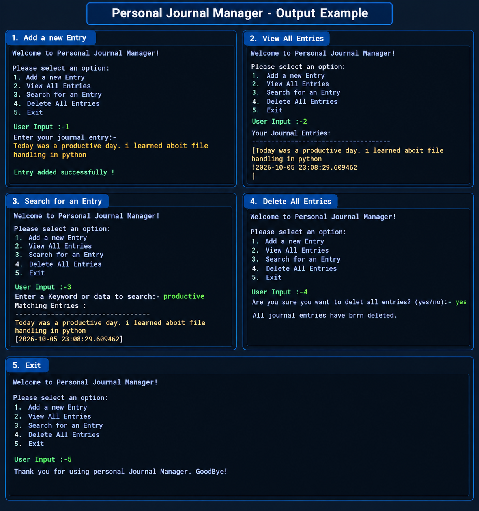

# Personal Journal Manager

A simple command-line interface (CLI) application built in Python to help users manage their daily personal journal entries. Users can securely add, view, search, and reset their journal logs directly from the terminal.

## Description
The **Personal Journal Manager** allows you to maintain a digital diary safely stored in a local text file. It provides an intuitive, interactive menu loop where you can quickly document your thoughts, look back at previous moments using key terms, or wipe the file clean to start fresh. 

## Features
- **Add a New Entry**: Write down your thoughts and automatically append them alongside a date and time stamp.
- **View All Entries**: Read your entire journal history printed straight to the terminal screen.
- **Search for an Entry**: Look up specific past records instantly using keywords or phrases.
- **Delete All Entries**: Clean slate capability to clear your logs entirely with a safety confirmation prompt.
- **Interactive Menu Loop**: Simple numerical choices that validate inputs smoothly.

## Technologies Used
- **Python 3.x** (Core programming language)
- **Built-in `datetime` Module** (For tracking entry timestamps)
- **Native File I/O Handling** (For persistent storage using `journal.txt`)

## Installation & Running the Application

### Prerequisites
Make sure you have Python installed on your system. You can check this by running:
```bash
python --version
```

### Setup Steps
1. Clone or download the script file (e.g., `journal_manager.py`) to your local machine.
2. Open your terminal or command prompt and navigate to the folder where the file is saved.
3. Run the script using the following command:
   ```bash
   python main.py
   ```

## Directory Structure
```text
.
├── README.md
├── main.py
├── output.png   
└── journal.txt          
```

## Sample Output



```text
Welcome to Personal Journal Manager!

Please select an option:
1. Add a new Entry 
2. View All Entries 
3. Search for an Entry 
4. Delete All Entries 
5. Exit

User Input :-1
Enter your journal entry:- Had a highly productive coding day!
Entry added successfully !
```

## Author

**Virendra Nakum**
